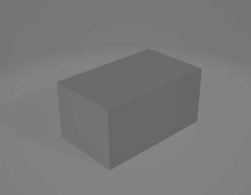
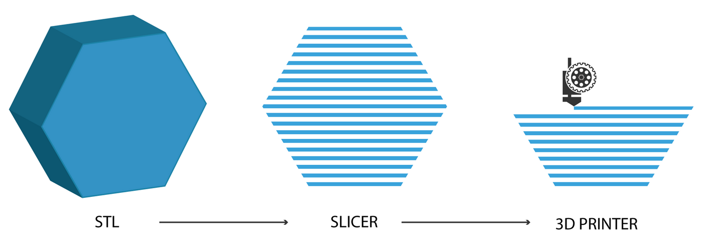
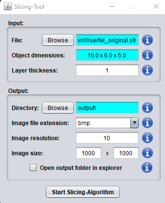
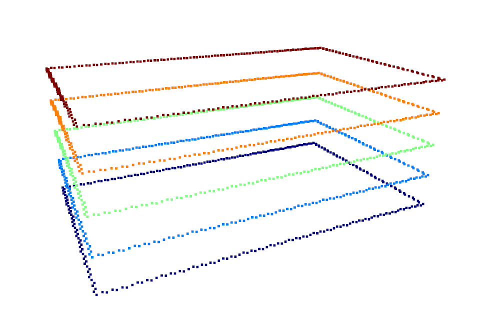
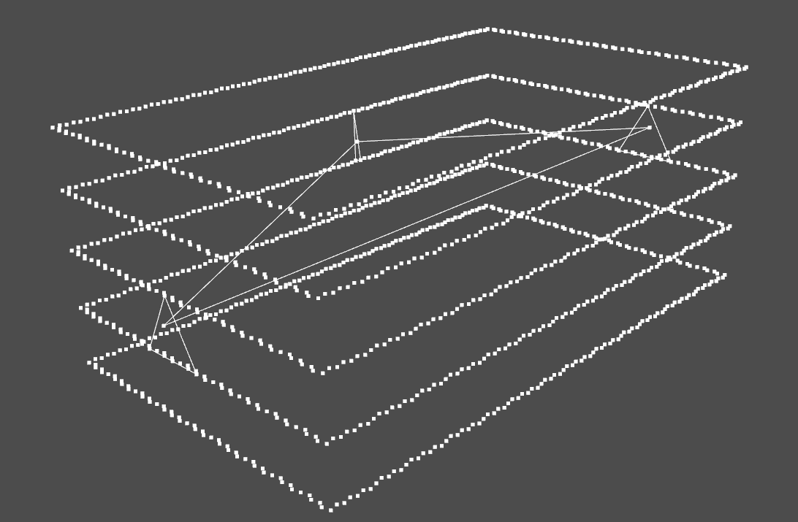
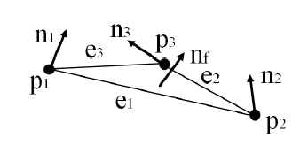
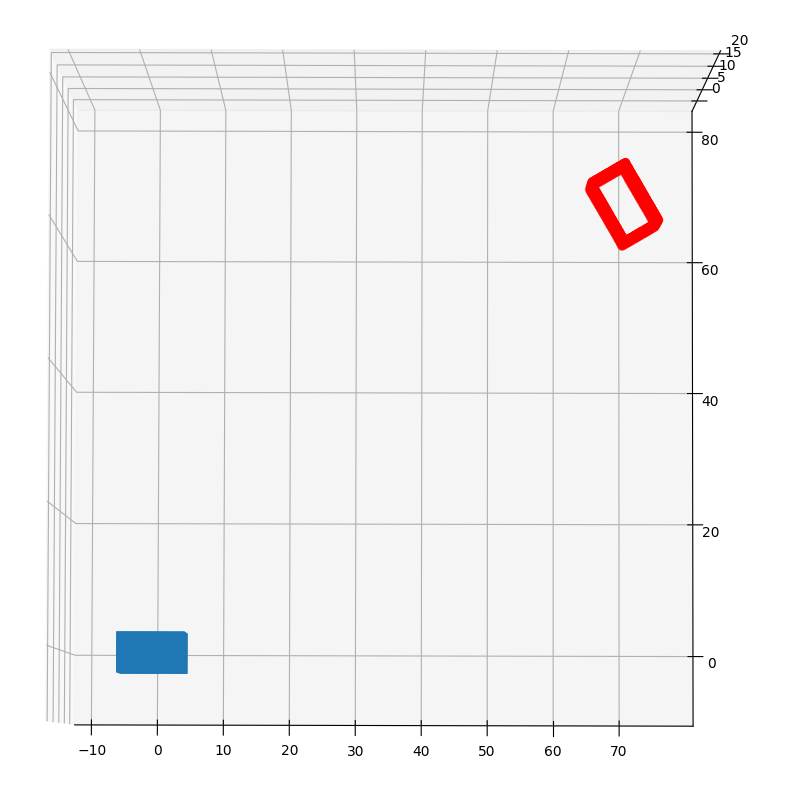
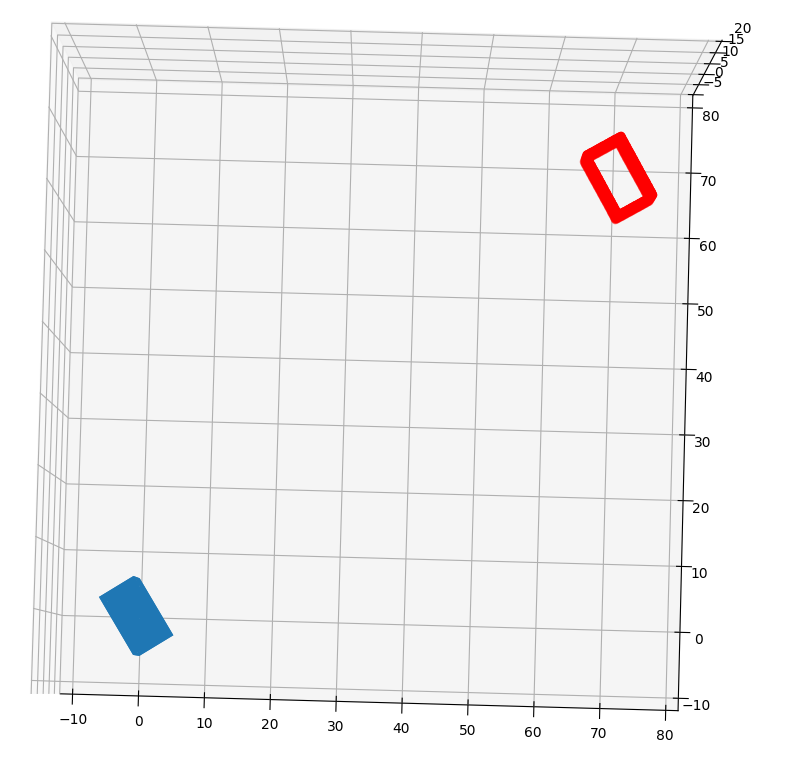
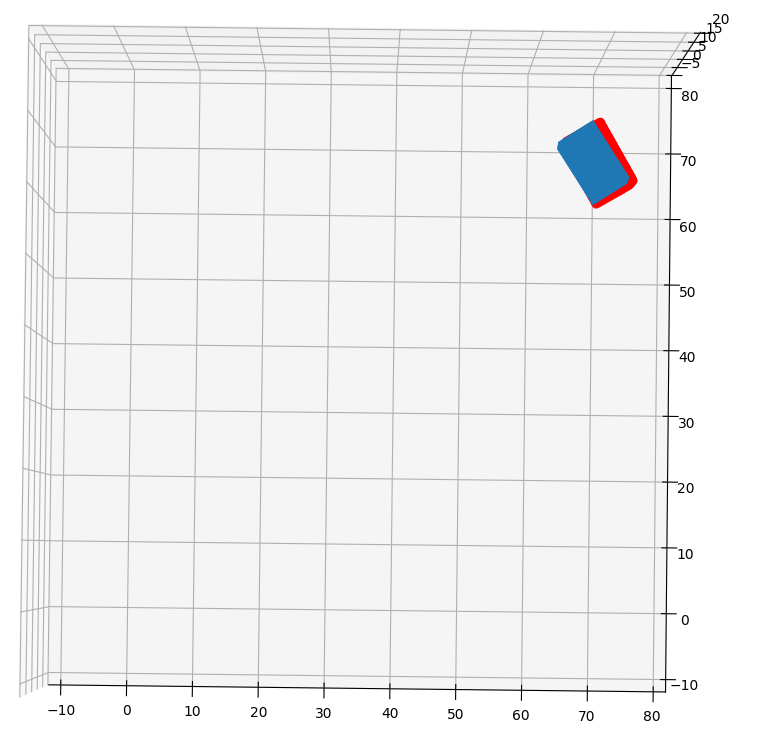

# Produktionsinformatik

## Introduction
The process deals with 3D-printing. The Binder-Jetting process is analysed here. Components are printed and cured, which are then gripped by a robotic arm and guided into the next process phase.  After the component has been printed, it is often not clear how it is positioned. The printing software always tries to find the optimum positioning for a component.
The aim is therefore to determine the transformation and rotation of the component after the printing process, so that the current positioning of the component can be transferred to the robot's gripper. The output is therefore a rotation matrix and a translation vector. 

## Prerequisites
Before you start, make sure that you have fulfilled the following requirements:
- Python 3.7 and pip 3.7 Installation
- Git 
- Project developed on Windows
- stl-datafile and a sliced version the component after the printing cycle

## Installation
Führen Sie die folgenden Schritte aus, um das Projekt zu starten:

1. **Repository klonen:**
    ```bash
    git clone https://github.com/erlbacsi/Produktionsinformatik.git
    ```

2. **In das Projektverzeichnis wechseln:**
    ```bash
    cd Project
    ```

3. **Abhängigkeiten installieren:**
    ```bash
    pip install -r Requirements.txt
    ```

## Application
Nach der Installation können Sie das Projekt wie folgt starten:

1. **Set data paths:**
    The file Main.py contains two marked paths, for the specific data files. The variable **path** keeps the directory for the sliced component pictures. The variable **path_stl** keeps the directory to the stl-datafile.
    ```bash
    path = "path/to/sliced/data"
    path_stl = "path/to/stl/data/component.stl"
    ````
    If you want to visualize the components, you need to set the path to the original stl-datafile, via the variabel **m1** (also in Main.py).
    The project also contains a testing dataset in the "__Produktionsinformatik/Data__" folder.

2. **Start project (Windows):**
    ```bash
    python .\Main.py
    ```

## Visualization
Here are the created plots, during the execution of the program:

### Step 1: Current stl-data


### Step 2: Slice stl-data (Available Slicing-Tool)



### Schritt 3: Create pointcloud from the sliced stl-data


### Schritt 4: Create unique triangle in the pointcloud




Goal is to find this unique triangle in the original stl-data and calculate the transformation between them. The unique vector contains 3 distances $e$ between the points $p$ and 3 angles between the norm vector of the unique triangle $n_f$ and the other three norm vectors $n$ of the points p.

### Schritt 5: Visualized solution
With the calculated rotation and translation, it is possible to transform the initial blue component on the position of the red component, which holds the position after the 3D-printing process.






## Sources
The main idea of this work is based on the gesture shape matching algorithm, from the following [paper](https://www.cs.cmu.edu/~yingli/Humanoid05.pdf).

